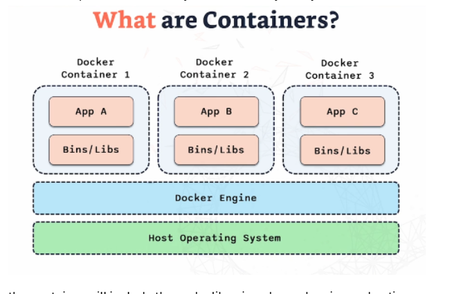

# Containers

## What Are Containers?
Containers are **portable units of software** that package an application together with its dependencies (code, libraries, runtime, etc.). This ensures the application can run **consistently and reliably across different environments**, regardless of the underlying system.  

A container provides:  
- Its **own file system**  
- Isolated **network stack**  
- Dedicated **resources**  

This isolation ensures containers do not interfere with one another, while still being lightweight compared to traditional virtual machines.

---

## Docker Architecture Diagram

## Key Components of Docker

### **1. Containers**
- Store and run applications with all necessary dependencies.  
- Provide isolation, consistency, and security across environments.  
- Ensure applications behave the same in **development, testing, and production**.  

---

### **2. Docker Engine**
- The **core service** that builds, runs, and manages containers.  
- Handles container lifecycle (start, stop, remove).  
- Manages resource allocation (CPU, memory, storage, networking).  
- Ensures containers operate properly in isolation.  

---

### **3. Host Operating System**
- The underlying **operating system** where Docker Engine runs.  
- Provides the environment for containers to operate.  

---

### **4. Infrastructure**
- The **physical and network resources** required to host Docker and its containers.  
- Includes servers, storage, and networking components.  

---

### **5. Docker Hub**
- A **central repository** for finding, sharing, and storing Docker images.  
- Provides access to official images as well as community-contributed ones.  
- Allows teams to publish and pull prebuilt container images.  

---

